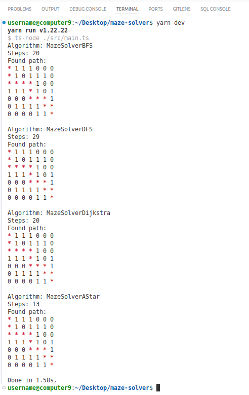
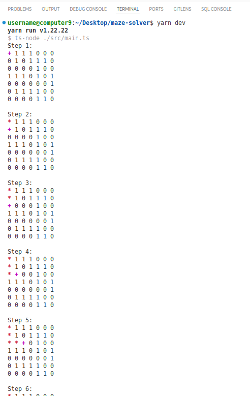
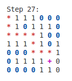
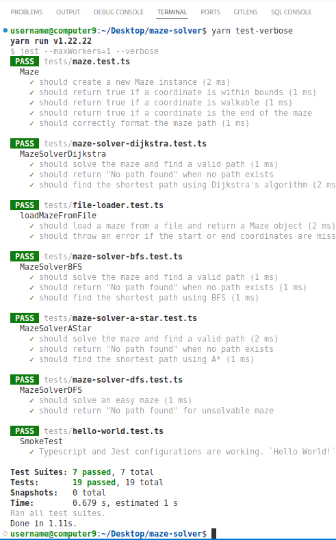
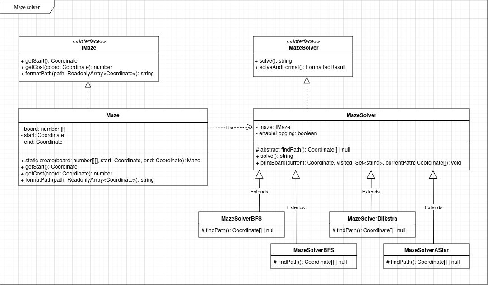

# Maze solver

Maze solver implemented using BFS, DFS, Dijkstra, A\* algorithms with Jest unit tests and code coverage. Input maze can be defined in code or in a file in `tests/fixtures`. Use `src/config.ts` to enable or disable additional logging for printing maze and current path at each step of the search. The code is well commented.

## Requirements

- Maze representation and path finding
- Implement multiple solvers
- Automated tests
- Read mazes from input files
- Document the process and comment the code

## Installation and running

```bash
# install dependencies
yarn install

# enable or disable logging in src/config.ts

# run in dev mode
yarn dev

# logging is disabled for tests by default

# run tests
yarn test

# run tests in verbose mode
yarn test-verbose

# generate coverage report
yarn coverage
```

## Screenshots

### Development



### Development with logging enabled



#### Logging legend

Defined in `src/utils/colors.ts`.

- red `*` - current path
- magenta `+` - current cell
- blue `0` - visited cell



### Test verbose



### Coverage


## Architecture

Project uses polymorphism and simplified Factory pattern. `MazeSolver` is an abstract class that declares `findPath()` method that is implemented in each derived concrete solver class.

```ts
export abstract class MazeSolver implements IMazeSolver {
  protected maze: IMaze;

  protected abstract findPath(): Coordinate[] | null;

  // ...
}
```

It uses coding towards interface, separating interfaces from implementations by exposing only the public class methods through the interfaces.

```ts
// Maze interface
export interface IMaze {
  getBoard(): number[][];

  getStart: () => Coordinate;

  formatPath: (path: ReadonlyArray<Coordinate>) => string;

  // ...

}

// Maze implementation
export class Maze implements IMaze {

  public getBoard(): number[][] { ... }

  public getStart(): Coordinate { ... }

  public formatPath(path: ReadonlyArray<Coordinate>): string { ... }

  // ...
}

// usage
const _maze2: IMaze = Maze.create(testMaze, start, end);
```

### Class diagram



### Note

While using the Strategy pattern to encapsulate each algorithm as a separate strategy that can be dynamically instantiated and assigned to a solver would make sense, I decided it would be overkill for this relatively simple use case. It would bloat the tests and make the project less practical to review and present.

## Algorithms

Paths in a maze form a tree structure or a graph if a maze has cycles. Thats why tree and graph traversal algorithms can be used for finding paths and the shortest path in a maze.

## References

- Starter project, Typescript, Jest https://github.com/julianmateu/hello-ts
- Some visualized algorithms behavior https://www.youtube.com/watch?v=GC-nBgi9r0U
- BFS vs DFS, basic overview and implementation https://www.geeksforgeeks.org/difference-between-bfs-and-dfs/
- BFS vs Dijkstra similarities https://stackoverflow.com/a/52676408/4383275
- Visual playgrounds https://visualmazesolver.vercel.app/, http://qiao.github.io/PathFinding.js/visual/
