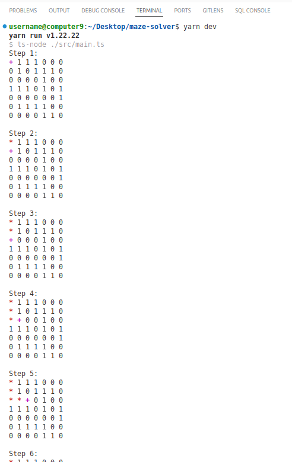
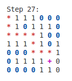
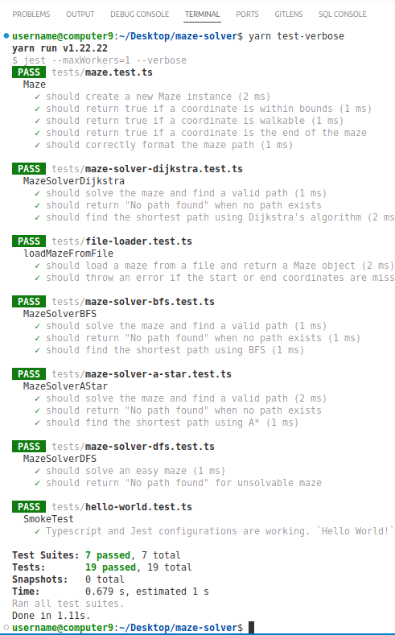
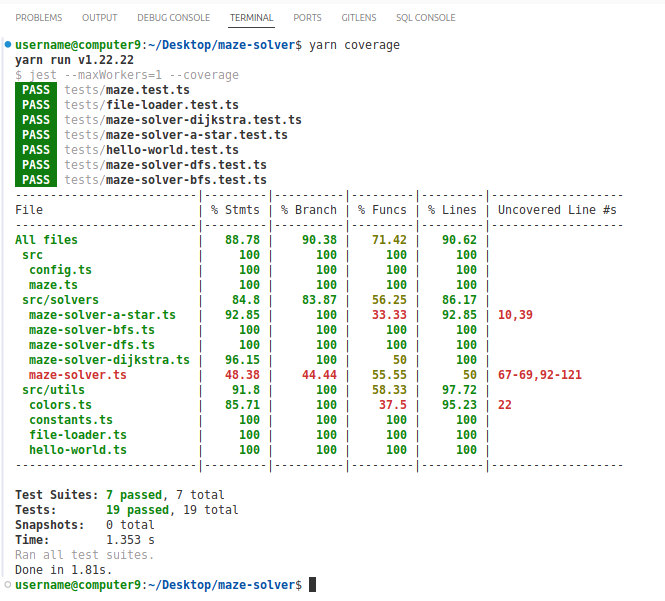

# Maze solver

Maze solver implemented using BFS, DFS, Dijkstra, A\* algorithms with Jest unit tests and code coverage. Input maze can be defined in code or in a file in `tests/fixtures`. Use `src/config.ts` to enable or disable additional logging for printing maze and current path at each step of the search.

## Requirements

- Maze representation and path finding
- Implement multiple solvers
- Automated tests
- Read mazes from input files

## Installation and running

```bash
# install dependencies
yarn install

# enable or disable logging in src/config.ts

# run in dev mode
yarn dev

# logging is disabled for tests by default

# run tests
yarn test

# run tests in verbose mode
yarn test-verbose

# generate coverage report
yarn coverage
```

## Screenshots

### Development


### Development with logging enabled



#### Logging legend

Defined in `src/utils/colors.ts`.

- red `*` - current path
- magenta `+` - current cell
- blue `0` - visited cell



### Test verbose



### Coverage



## Architecture

## Algorithms

## References

- Starter project, Typescript, Jest https://github.com/julianmateu/hello-ts
- Some visualized algorithms behavior https://www.youtube.com/watch?v=GC-nBgi9r0U
- BFS vs DFS, basic overview and implementation https://www.geeksforgeeks.org/difference-between-bfs-and-dfs/
- BFS vs Dijkstra similarities https://stackoverflow.com/a/52676408/4383275
- Visual playgrounds https://visualmazesolver.vercel.app/, http://qiao.github.io/PathFinding.js/visual/
