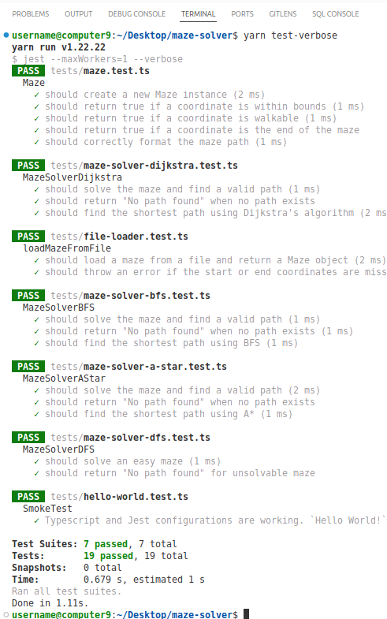

# Maze solver

Maze solver implemented using BFS, DFS, Dijkstra, A\* algorithms with Jest unit tests and code coverage. Input maze can be defined in code or in a file in `tests/fixtures`. Use `src/config.ts` to enable or disable additional logging for printing maze and current path at each step of the search. The code is well commented.

## Requirements

- Maze representation and path finding
- Implement multiple solvers
- Automated tests
- Read mazes from input files
- Document the process and comment the code

## Installation and running

```bash
# install dependencies
yarn install

# enable or disable logging in src/config.ts

# run in dev mode
yarn dev

# logging is disabled for tests by default

# run tests
yarn test

# run tests in verbose mode
yarn test-verbose

# generate coverage report
yarn coverage
```

## Screenshots

### Development


### Development with logging enabled


#### Logging legend

Defined in `src/utils/colors.ts`.

- red `*` - current path
- magenta `+` - current cell
- blue `0` - visited cell


### Test verbose



### Coverage


## Architecture

Project uses polymorphism and simplified Factory pattern. `MazeSolver` is an abstract class that declares `findPath()` method that is implemented in each derived concrete solver class.

```ts
export abstract class MazeSolver implements IMazeSolver {
  protected maze: IMaze;

  protected abstract findPath(): Coordinate[] | null;

  // ...
}
```

It uses coding towards interface, separating interfaces from implementations by exposing only the public class methods through the interfaces.

```ts
// Maze interface
export interface IMaze {
  getBoard(): number[][];

  getStart: () => Coordinate;

  formatPath: (path: ReadonlyArray<Coordinate>) => string;

  // ...

}

// Maze implementation
export class Maze implements IMaze {

  public getBoard(): number[][] { ... }

  public getStart(): Coordinate { ... }

  public formatPath(path: ReadonlyArray<Coordinate>): string { ... }

  // ...
}

// usage
const _maze2: IMaze = Maze.create(testMaze, start, end);
```

### Class diagram


### Note

While using the Strategy pattern to encapsulate each algorithm as a separate strategy that can be dynamically instantiated and assigned to a solver would make sense, I decided it would be overkill for this relatively simple use case. It would bloat the tests and make the project less practical to review and present.

## Algorithms

Paths in a maze form a tree structure or a graph if a maze has cycles. Thats why tree and graph traversal algorithms can be used for finding paths and the shortest path in a maze.

All 4 algorithms differ in just a few lines of code, but they behavior differs drastically.

### BFS and DFS

BFS and DFS have only a single line difference, but they have a completely opposite behavior. BFS uses a queue (FIFO), and DFS uses a stack (LIFO) and this has a fundamental impact on the way the next node candidate for the path is selected.

```ts
// BFS
const { coord, path } = queue.shift()!;

// DFS
const { coord, path } = stack.pop()!;
```

This is the array of coordinates that represents possible directions for a movement. This array is iterated over in the algorithms inner loop.

```ts
export const directions: Direction[] = [
  { x: 0, y: 1 }, // right
  { x: 1, y: 0 }, // down
  { x: 0, y: -1 }, // left
  { x: -1, y: 0 }, // up
];
```

#### BFS

Since BFS uses a queue, it will respect this structure and attempt to change direction in every iteration of the outer loop. Without obstacles and boundaries, this will cause the algorithm to thoroughly inspect nodes closer to the starting node before moving further away. Thats why BFS can be inefficient for the large trees and graphs where the end node is very distant from the starting node.

#### DFS

In contrast, DFS will also respect initial order in the directions array but prioritizes the upper elements, so in the example above it will always attempt to apply `right` direction first before exploring other directions. Without obstacles and boundaries this will cause the algorithm to inspect the distant nodes in a straight line. DFS can be efficient to find distant a end node efficiently but also can be very inefficient to find close node if it happens to be in the different direction.

#### Weighted vs unweighted

Both BFS and DFS ignore the weights of the edges so they are applicable only on unweighted graphs and not on weighted graphs (edges don't have uniform weights) where Dijkstra should be used.

### Dijkstra and A\*

### Dijkstra

Dijkstra is aware of the cost between two nodes (edge weight) and it will take it into account when selecting the next node. It uses a priority queue to keep the cost history.

```ts
// Take the first element from the priority queue.
// Choose the node that ads minimal cost.
queue.sort((a, b) => a.cost - b.cost);
const { coord, path, cost } = queue.shift()!;

// ...

// Test how much cost every new node ads to the path before adding it to the queue.
const nextCost = cost + this.maze.getCost(nextCoord);
// ...
if( ... && !costMap.has(coordKey) || nextCost < costMap.get(coordKey)!)
```

Dijkstra keeps a history of the cost of the current path and when selecting the next node it will choose the node that does minimal addition to the cost. If there are cycles it will access the same node from multiple paths and will choose the one with minimal weight (shortest path). In graphs with constant edge weights it reduces to BFS. That can be observed in the screenshot above where both BFS and Dijkstra take an equal number of steps, because the maze has uniform weight of 1 and Infinity.

### A\*

A\* is same as Dijkstra but beside the keeping the history it uses the heuristics function to predict the future - the direction in which the end node could be.

```ts
protected heuristic(a: Coordinate, b: Coordinate): number {
    // Manhattan distance as the heuristic.
    // Can only move horizontally or vertically, not diagonally. In "rectangles".
    return Math.abs(a.x - b.x) + Math.abs(a.y - b.y);
}

// ...

openSet.sort(
  (a, b) =>
    // The most important line. The only difference from Dijkstra.
    // Cost = history + Manhattan distance from the end node.
    // prettier-ignore
    (a.cost + this.heuristic(a.coord, end)) -
    (b.cost + this.heuristic(b.coord, end))
);
```

If the heuristic function is well chosen it will make A\* more efficient than the before mentioned algorithms. Consequently, if the heuristic function is poorly chosen it will degrade the algorithm efficiency.

## References

- Starter project, Typescript, Jest https://github.com/julianmateu/hello-ts
- Some visualized algorithms behavior https://www.youtube.com/watch?v=GC-nBgi9r0U
- BFS vs DFS, basic overview and implementation https://www.geeksforgeeks.org/difference-between-bfs-and-dfs/
- BFS vs Dijkstra for unweighted and weighted graphs https://www.baeldung.com/cs/graph-algorithms-bfs-dijkstra
- BFS vs Dijkstra similarities https://stackoverflow.com/a/52676408/4383275
- Visual playgrounds https://visualmazesolver.vercel.app/, http://qiao.github.io/PathFinding.js/visual/
